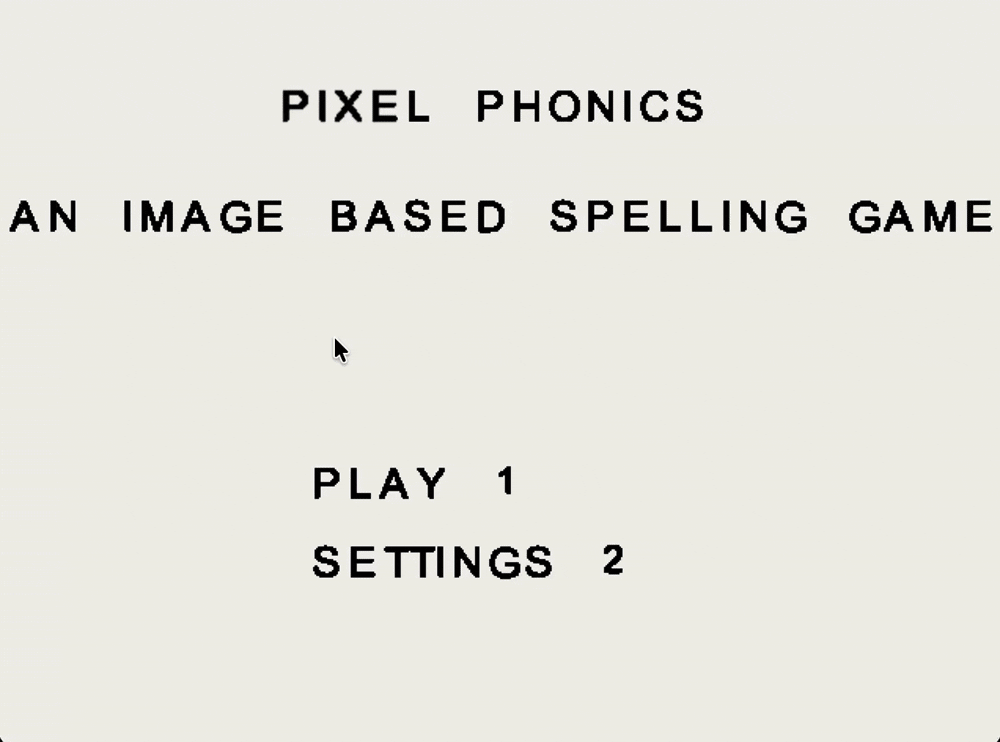

# PixelPhonics

> An FPGA-based educational spelling game built on the Altera DE2-115 board, featuring non-blocking I/O drivers, VGA graphics, and audio feedback.

---

## 📖 Overview
**PixelPhonics** is an educational, microprocessor-based toy designed to gamify spelling for children ages 8-10. Built on an Altera DE2-115 FPGA board, the game presents users with image prompts and requires them to spell the corresponding word using a physical keyboard. 

The system provides immediate multi-sensory feedback through visual VGA affirmations and audio cues, helping to close the literacy gap by making spelling practice an engaging, fast-paced game.

*This project was developed as part of the ENGR-100: Microprocessors and Toys course at the University of Michigan.*

---

## 👨‍💻 My Contributions
As this repository represents my portfolio copy of the team project, my specific engineering contributions included:
* **Hardware Drivers:** Authored the non-blocking assembly code for the hardware drivers, specifically interfacing with the QWERTY keyboard, SD card, and SDRAM.
* **Core Game Logic:** Programmed the main finite-state machines managing the gameplay, point/streak systems, and the interactive settings menu.
* **Performance Optimization:** Ensured smooth, freeze-free gameplay by utilizing a non-blocking architecture across all I/O devices, achieving sub-second in-game loading transitions.

---

## 🛠️ Hardware & Tech Stack
* **Board:** Altera DE2-115 FPGA
* **Peripherals:** * VGA Monitor
  * QWERTY Keyboard
  * External Speaker
  * SD Card (Memory)
* **Languages:** * Verilog (Combinational & Sequential Logic)
  * Assembly Language (System Operations & I/O)

---

## ✨ Key Features
* **Gamified Literacy:** Rewards correct answers with points, a streak counter, and an upbeat audio tone to build a growth mindset.
* **Adjustable Difficulty:** Features an interactive settings menu with toggleable audio and distinct difficulty tiers (Easy for grades 3-4, Medium for grades 4-5).
* **Hardware-Level Optimization:** Achieves rapid in-game loading (< 1 second) and responsive inputs through custom data paths and direct memory access (SD to SDRAM transfers).

---

## 📸 Media & Visuals
* 
* ``
* ``

---

## 🚀 Future Roadmap
Based on our team's final performance review, potential future improvements include:
* **Audio Mode:** Reading words aloud to strengthen phonemic awareness.
* **On-Screen Keyboard & Hints:** To reduce frustration and familiarize users with keyboard layouts.
* **Standalone Microcontroller Port:** Migrating the logic from an FPGA to a more portable format for true standalone use.
